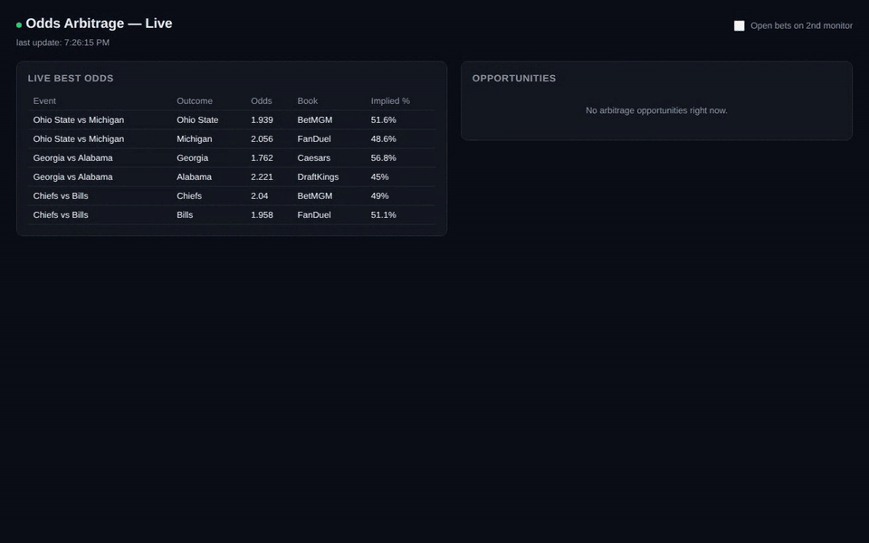

# Sports Odds Arbitrage Detector

Scans odds from several sportsbooks, finds arbitrage opportunities (prices that disagree enough that betting every outcome locks in a profit), sizes the stakes, and uses an LLM to explain each opportunity in plain English. Runs on simulated odds out of the box, or on live NFL, NBA, NHL, MLB and college odds from [The Odds API](https://the-odds-api.com/).



*The web dashboard on simulated odds: best price per outcome on the left, and on the right each opportunity as it opens, with stakes per book and a plain-English summary.*

## What it does

| Part | What it does | File |
|---|---|---|
| Data model | Typed records for outcomes, odds snapshots and opportunities | `models.py` |
| Simulated feed | Generates independent price movement across 5 books and 3 events, so the demo runs with no setup | `simulator.py` |
| Live feed | Pulls real odds for one or more leagues through The Odds API, behind the same interface as the simulator | `live_feed.py` |
| Detection | Finds the best price per outcome across books, checks whether combined implied probability is under 100%, and sizes stakes | `arbitrage.py` |
| LLM analyst | Turns each opportunity into a short trader summary with caveats; uses Claude when an API key is set, a template otherwise | `llm_analyst.py` |
| Terminal dashboard | Live table of best odds and opportunities | `main.py` |
| Web dashboard | Browser page that flashes opportunities in and out as they appear, with links to each book | `live_dashboard.py` |

## How the math works

For each event, take the best decimal odds available for every outcome across all books. Each price implies a probability of `1 / odds`. If those implied probabilities add up to less than 100%, the books disagree enough that staking each outcome in proportion to its implied probability returns the same amount whatever happens.

Worked example: Chiefs at 2.314 on one book and Bills at 2.243 on another imply 43.2% + 44.6% = 87.8%, so a $1,000 stake split $492 / $508 returns the same payout either way, a 12.2% margin.

## Design decisions

- **One feed interface.** The simulator and the live feed both expose the same `stream()` generator, so switching from demo data to real data is a command-line flag, not a code change.
- **Keys stay out of the code.** API keys are read from environment variables only (`ODDS_API_KEY`, `ANTHROPIC_API_KEY`).
- **Works with zero configuration.** Without an Anthropic key, the analyst falls back to a template summary, so anyone can clone and run it.
- **The tool never places bets.** It finds and explains opportunities; a person decides and acts.

## Run it

```bash
python3 -m venv .venv
source .venv/bin/activate
pip install -r requirements.txt

# Terminal dashboard on simulated odds (no keys needed)
python main.py

# Web dashboard on simulated odds, then open http://localhost:8765
python live_dashboard.py --source sim --poll-seconds 2

# Live odds across several leagues (free key from the-odds-api.com)
export ODDS_API_KEY=your-key-here
python live_dashboard.py --source live --sport nfl nba nhl --poll-seconds 20

# Claude-written summaries instead of the template
export ANTHROPIC_API_KEY=your-key-here
python main.py
```

Options: `--ticks`, `--stake`, `--tick-seconds` (terminal) and `--stake`, `--poll-seconds`, `--port` (web).

**Tests:**

```bash
pip install -r requirements-dev.txt
pytest -q
```

They check best-price selection, the arbitrage threshold, that stakes sum to the total and pay out the same whichever side wins, that every simulated book keeps its own margin, parsing of The Odds API's response format (no network needed), and the template summary. GitHub Actions runs them on every push. Each test file also runs on its own (`python test_arbitrage.py`) to print a short demo.

## Limitations

- Each simulated book keeps a margin of at least 2% on its own prices, as real books do, so opportunities only come from two books disagreeing. The books still drift apart more than real ones, so the simulator shows opportunities far more often than a live market would.
- Real arbitrage closes fast: prices can move before every leg is placed, and books may limit accounts that bet this way.
- Moneyline (head-to-head) markets only; spreads, totals and props would need new market handling.

## What's next

- Store every detected opportunity and how long it lasted
- Alerts by Slack, email or webhook above a chosen margin
- Spreads, totals and player props

For education and analysis. Check the rules where you live before betting.

## License

MIT. See [LICENSE](LICENSE).
